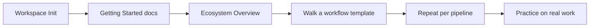

# Workflow: Full Onboarding

**Pipeline**: cogni-workspace → docs/ → `/workflow` templates → practice
**Duration**: ~6–7 hours total (spread across sessions)
**Use case**: New user learning the complete insight-wave ecosystem

## Step 1: Initialize Workspace

**Command**: `/manage-workspace`

**Input**: Your project directory
**Output**: Configured workspace with env vars, settings, themes, and plugin discovery

**Tips**:
- Do this before anything else — the workspace provides the foundation every plugin reads
- Choose your language preference (EN/DE) during setup
- Pick a theme with `/pick-theme` — it affects all visual output

## Step 2: Read the Orientation Docs

**Input**: `docs/getting-started.md`, then `docs/ecosystem-overview.md`

**Output**: A mental map of what the plugins are and how they connect

**Tips**:
- `docs/getting-started.md` covers installation and first run
- `docs/ecosystem-overview.md` answers "what plugins are available and how do they connect"
- Both are generated by cogni-docs and track the current plugin set

## Step 3: Walk the Workflow Templates

**Command**: `/workflow` (no argument lists the canonical set)

Work through the seven canonical pipelines. Each template names the plugin chain,
the command per step, and the pitfalls. Later pipelines assume the earlier ones have
given you the cross-plugin reflexes:

| Workflow | Pipeline | Time |
|----------|----------|------|
| `install-to-infographic` | cogni-workspace → themes → cogni-visual | ~45 min |
| `research-to-report` | cogni-knowledge → cogni-narrative → cogni-visual | ~45 min |
| `trends-to-solutions` | cogni-trends → cogni-portfolio → cogni-marketing | ~50 min |
| `content-pipeline` | cogni-marketing → cogni-narrative → cogni-copywriting → cogni-visual | ~50 min |
| `portfolio-to-pitch` | cogni-portfolio → cogni-narrative → cogni-sales → cogni-visual | ~50 min |
| `portfolio-to-website` | cogni-portfolio → cogni-workspace → cogni-website | ~45 min |
| `consulting-engagement` | cogni-consult (setup → scope → action fields → design-thinking → personas) | ~60 min |

**Tips**:
- Start with `install-to-infographic` — it is the shortest chain that still crosses three
  plugins, and the artifact it produces doubles as a smoke test that the workspace is
  configured correctly
- Each canonical ID has a matching tutorial at `docs/workflows/<id>.md` — read it alongside
  the template
- Check plugin prerequisites before starting a pipeline; install missing plugins via the
  marketplace
- `consulting-engagement` is the capstone — a full cogni-consult engagement: action-field
  WBS, per-deliverable design-thinking loops, and a compounding cogni-knowledge base

## Step 4: Practice

Reinforce with real work rather than more reading:

1. Pick a small project in your domain
2. Use `/guide` to find the right plugins for your task
3. Use `/workflow` to see how those plugins chain together
4. Use `/cheatsheet <plugin>` when you need a command refresher
5. File issues with `/issues` if you encounter problems

## Common Pitfalls

- **Skipping install-to-infographic**: Even experienced users benefit from walking the
  workspace → themes → visual handoff once, because it exercises the configuration every
  other pipeline depends on.
- **Reading without running**: The templates are playbooks, not tutorials. Run the commands
  against a real project directory — the handoff shapes only stick once you have produced
  an artifact.
- **Binge onboarding**: Spread the pipelines across sessions. Concepts settle better with
  gaps between them.
