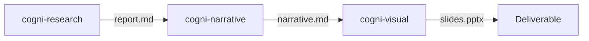

# Workflow: Research to Report

**Pipeline**: cogni-research → cogni-narrative → cogni-visual
**Duration**: 2-4 hours depending on research depth
**Use case**: Analyst producing a presentation from original research

## Step 1: Research (cogni-research)

**Command**: `/research`

**Input**: A research question or topic brief
**Output**: A structured research report with citations and claims

**Tips**:
- Choose depth level: basic (30 min), detailed (1-2 hr), deep (2-4 hr)
- For executive audiences, basic or detailed is usually sufficient
- Claims are auto-verified via cogni-claims during the research loop

## Step 2: Narrative (cogni-narrative)

**Command**: `/narrate`

**Input**: The research report from Step 1
**Output**: An executive narrative shaped by a story arc

**Tips**:
- Choose the arc that fits your audience: SCQA for problem-solution, Minto Pyramid
  for recommendation-first, Hero's Journey for transformation stories
- Review the narrative before proceeding — this is where the story takes shape
- Use `/review-narrative` for quality scoring

## Step 3: Visual (cogni-visual)

**Command**: `/render-slides`

**Input**: The polished narrative from Step 2
**Output**: A PPTX slide deck

**Tips**:
- The theme is applied from your workspace settings
- Request specific slide count if you have time constraints
- For web delivery, consider `/render-web-narrative` instead of slides

## Common Pitfalls

- **Skipping the narrative step**: Going directly from research to slides produces
  data-heavy, story-light presentations. The narrative step is where insight emerges.
- **Wrong research depth**: Deep research for a 5-slide deck wastes time. Match
  research depth to deliverable scope.
- **Not verifying claims**: If you bypass cogni-research and bring your own content,
  consider running `/verify-claims` before the narrative step.
