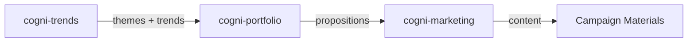

# Workflow: Trend to Marketing

**Pipeline**: cogni-trends → cogni-portfolio → cogni-marketing
**Duration**: 3-6 hours for a full campaign
**Use case**: GTM team turning strategic trends into marketing campaigns

## Step 1: Trend Scouting (cogni-trends)

**Command**: `/scout`

**Input**: Industry or domain to analyze
**Output**: Trend candidates mapped to Trendradar dimensions, investment themes (Handlungsfelder)

**Tips**:
- Scout broadly first, then narrow to 3-5 actionable trends
- Use `/report` to produce a trend report if stakeholders need justification
- The investment themes (Handlungsfelder) are what cogni-portfolio consumes

## Step 2: Portfolio Propositions (cogni-portfolio)

**Command**: `/portfolio-setup` → `/portfolio-draft`

**Input**: Investment themes from Step 1, plus your product/service catalog
**Output**: Propositions mapped to markets using IS/DOES/MEANS framework

**Tips**:
- Features (IS) are market-independent — define them once
- Advantages (DOES) and Benefits (MEANS) vary by market — define per-market
- TAM/SAM/SOM sizing helps prioritize which markets to target first
- The propositions are what cogni-marketing consumes as content fuel

## Step 3: Marketing Content (cogni-marketing)

**Command**: `/marketing-brief` → `/marketing-content`

**Input**: Propositions from Step 2, themes from Step 1
**Output**: Channel-ready content across 16 formats

**Tips**:
- Start with a marketing brief to define the campaign scope
- The 3D content matrix (themes × propositions × channels) ensures coverage
- Generate content for the highest-priority channels first
- Bilingual DE/EN support — set language in the brief

## Common Pitfalls

- **Weak trend selection**: If the trends are too generic, the marketing content
  will be too. Invest time in Step 1 to find specific, actionable trends.
- **Proposition gaps**: If propositions don't clearly map to trends, the marketing
  content won't have a compelling "why now" story.
- **Channel overload**: Don't generate all 16 formats at once. Start with 3-4
  priority channels and expand.
