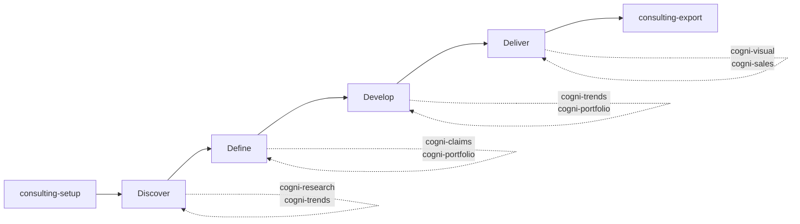

# Consulting Engagement

**Pipeline**: cogni-consulting orchestrates cogni-research + cogni-trends (Discover) → cogni-portfolio + cogni-claims (Define) → cogni-trends value-modeler + cogni-portfolio (Develop) → cogni-visual + cogni-sales (Deliver)
**Duration**: Days to weeks depending on engagement scope
**End deliverable**: A full consulting deliverable package — slide deck, proposal document, and supporting materials



## What You Get

A structured Double Diamond consulting engagement with persistent state, phase gates, and plugin dispatch at each phase. cogni-consulting acts as the senior partner coordinating the engagement — it doesn't produce content itself, but manages when and how each plugin runs.

The deliverable package at the end of the engagement includes:
- Executive slide deck (via cogni-visual)
- Sales presentation and proposal (via cogni-sales, for sales-oriented engagements)
- Research reports, trend analysis, and competitive intelligence (from Discover)
- Problem statement and portfolio propositions (from Define/Develop)
- Business case or roadmap (from Deliver)

## Prerequisites

| Requirement | Why |
|-------------|-----|
| cogni-consulting installed | Orchestrates the engagement lifecycle |
| cogni-research installed | Desk research during Discover |
| cogni-trends installed | Trend landscape during Discover; value modeling during Develop |
| cogni-portfolio installed | Proposition modeling during Define/Develop |
| cogni-claims installed | Assumption verification during Define; quality gate in Deliver |
| cogni-visual installed | Deliverable generation during Export |
| cogni-sales installed (optional) | Pitch deck generation for sales-oriented engagements |
| Web access enabled | Research and trend scouting both require web access |

cogni-consulting can run with any subset of these plugins — it dispatches only to what is installed and skips phases that lack their required plugins. The richer the plugin set, the fuller the engagement.

## Step-by-Step

### Step 1: Set Up the Engagement

`consulting-setup` frames the vision, captures the engagement scope, and scaffolds the project directory. You select a vision class — which determines which methods are available at each phase gate.

**Command**: `/consulting-setup` or describe the engagement

**Example prompts:**

```
Set up a consulting engagement for evaluating strategic options for cloud portfolio expansion in DACH
```

```
/consulting-setup
```

```
I need to run a market entry analysis for a FinTech client entering the DACH SME segment
```

**Vision classes:**

| Vision Class | Typical engagement type |
|-------------|------------------------|
| Strategic Options | Portfolio or market strategy decisions |
| Business Case | Investment justification |
| GTM Roadmap | Go-to-market planning |
| Cost Optimization | Efficiency and savings analysis |
| Digital Transformation | Technology modernization |
| Innovation Portfolio | New product or service development |
| Market Entry | New geography or segment expansion |
| Business Model Hypothesis | Startup or new business model validation |

After setup, cogni-consulting creates `consulting-project.json` — this is the engagement's persistent state file. All phase progress, method selections, and plugin references are stored here.

### Phase 1: Discover (D1 Diverge)

Discover is about breadth — casting a wide net across research, trend signals, and competitive landscape. cogni-consulting dispatches to cogni-research, cogni-trends, and cogni-portfolio in parallel.

**Command**: `/consulting-discover`

**Example prompts:**

```
/consulting-discover
```

```
Start the Discover phase — research cloud infrastructure trends and competitive landscape in DACH
```

**What gets dispatched:**

- **cogni-research**: Desk research on your engagement topic — produces a structured research report with sourced claims
- **cogni-trends**: Trend scouting across 4 Trendradar dimensions — 60 scored candidates, bilingual DACH coverage
- **cogni-portfolio** (if available): Competitive baseline — who the key players are and how they position

**Tips for Discover:**

- Cast wide before narrowing. Discover is not the place to decide which trends matter — collect them all.
- Run research and trend scouting simultaneously if you have separate questions. cogni-consulting will manage the parallel state.
- Document emerging hypotheses as you review findings — they feed into Define.

**Phase gate**: Before advancing to Define, review the Discover output. The `phase-analyst` agent assesses readiness and recommends whether you have enough material to converge.

```
Where are we? Is Discover complete enough to move to Define?
```

### Phase 2: Define (D1 Converge)

Define is where breadth converges to focus. You select the strongest opportunities, verify assumptions, and synthesize a clear problem statement.

**Command**: `/consulting-define`

**Example prompts:**

```
/consulting-define
```

```
Move to Define — let's synthesize the findings and verify the key assumptions
```

**What gets dispatched:**

- **cogni-claims**: Verifies the key assumptions and sourced claims from Discover output. Flags misquotations, unsupported conclusions, and stale data.
- **cogni-portfolio**: Structures propositions with IS/DOES/MEANS for the opportunities identified in Discover
- **Lean canvas methods**: cogni-consulting's built-in business model hypothesis class — test business model assumptions quickly before investing in solution development

**Tips for Define:**

- This is the most important convergence point. A weak problem statement leads to solutions that don't land.
- Run claims verification on any market statistics or competitive assertions before presenting to the client.
- Use cogni-portfolio's `portfolio-architecture` to visualize the product-feature structure after propositions are drafted — it reveals gaps before moving to Develop.

**Phase gate:**

```
Review the problem statement — are we ready for Develop?
```

### Phase 3: Develop (D2 Diverge)

Develop is the second diverge — generating solution options against the now-defined problem. cogni-consulting dispatches value modeling and proposition development.

**Command**: `/consulting-develop`

**Example prompts:**

```
/consulting-develop
```

```
Generate solution options based on the defined problem — use the trend investment themes
```

**What gets dispatched:**

- **cogni-trends value-modeler**: Builds T→I→P→S value chains from scouted trends and generates solution blueprints with portfolio composition
- **cogni-portfolio propositions**: Generates market-specific IS/DOES/MEANS messaging for each solution option

**Tips for Develop:**

- Generate 3–5 distinct solution options, not just one. The client needs to choose, and choice requires alternatives.
- Use the Big Block diagram (`/render-big-block`) to visualize solution architecture at this stage — it helps the client grasp structural differences between options.
- Score options on business relevance before advancing to Deliver.

**Phase gate:**

```
We have three solution options — which is strongest? Is Develop ready to converge?
```

### Phase 4: Deliver (D2 Converge)

Deliver converges solution options into a recommendation, scores opportunities, constructs the business case, and verifies final claims before producing deliverables.

**Command**: `/consulting-deliver`

**Example prompts:**

```
/consulting-deliver
```

```
Move to Deliver — score the options and build the business case for Option 2
```

**What gets dispatched:**

- **cogni-claims**: Final quality gate — verifies all sourced claims in the recommendation before client delivery
- **cogni-portfolio**: Final proposition verification and synthesis
- Opportunity scoring and business case or roadmap construction (handled by cogni-consulting's built-in methods)

**Tips for Deliver:**

- Do not advance to Export without running claims verification. The final deliverable is what the client sees — it carries your name.
- For sales-oriented engagements, feed the recommendation into cogni-sales for a full Why Change pitch.

### Step 5: Export the Deliverable Package

`consulting-export` generates the final deliverable files by dispatching to cogni-visual and document-skills.

**Command**: `/consulting-export`

**Example prompts:**

```
/consulting-export
```

```
Generate the final deliverable — executive slide deck and a Word document proposal
```

```
Export as slides and a web narrative — the client wants a digital leave-behind
```

**Match format to audience:**

| Audience | Recommended format |
|----------|--------------------|
| Executive boardroom | Slide deck (PPTX via cogni-visual) |
| Project team handoff | Detailed document (DOCX) |
| Digital follow-up | Web narrative (Pencil MCP via cogni-visual) |
| Workshop facilitation | Big Picture journey map (Excalidraw via cogni-visual) |

## Resuming an Engagement

Multi-session engagements are common. Resume from any phase:

```
/consulting-resume
```

```
Where are we on the Acme engagement?
```

cogni-consulting reads `consulting-project.json` and presents current phase status, completed phases, and the recommended next action.

## Variations

| Variation | What to change | When to use |
|-----------|---------------|-------------|
| Abbreviate to two phases | Run Discover + Deliver only | Short advisory engagements with clear problem definition |
| Sales-oriented exit | Feed Deliver output into cogni-sales `/why-change` | Engagement ends in a sales opportunity |
| Marketing-oriented exit | Feed Deliver output into cogni-marketing | Engagement produces GTM materials |
| Research-only Discover | Skip cogni-trends in Discover | Non-DACH market or trend scouting not relevant |
| Lean Canvas bootstrap | Use `portfolio-canvas` in Define | Client has a Lean Canvas; skip manual portfolio setup |
| Parallel Discover dispatches | Request research and trends simultaneously | Time-constrained engagements |

## Common Pitfalls

- **Rushing through Discover.** The quality of Define depends on thorough discovery. Moving to convergence before the landscape is understood produces narrow recommendations.
- **Skipping phase gates.** Phase gates are advisory, not mandatory — but bypassing Define with an unclear problem statement means Develop generates solutions to the wrong problem.
- **Not using the orchestrator.** cogni-consulting tracks phase state and prevents context loss across sessions. Manually chaining plugins without consulting-project.json means rebuilding context each session.
- **Missing claims verification in Deliver.** The final deliverable is your accountability. Claims that haven't been verified against their sources are a credibility risk.

## Related Guides

- [cogni-consulting plugin guide](../plugin-guide/cogni-consulting.md)
- [cogni-research plugin guide](../plugin-guide/cogni-research.md)
- [cogni-trends plugin guide](../plugin-guide/cogni-trends.md)
- [cogni-portfolio plugin guide](../plugin-guide/cogni-portfolio.md)
- [cogni-visual plugin guide](../plugin-guide/cogni-visual.md)
- [Research to Report workflow](./research-to-report.md) — the research pipeline used inside Discover
- [Trends to Solutions workflow](./trends-to-solutions.md) — the trends pipeline used inside Develop
- [Portfolio to Pitch workflow](./portfolio-to-pitch.md) — the sales pipeline used inside Deliver
