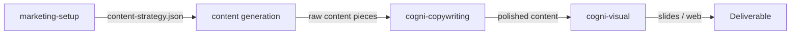

# Content Pipeline

**Pipeline**: cogni-marketing (setup + content generation) → cogni-copywriting (polish) → cogni-visual (slides / web)
**Duration**: 2–6 hours for a complete content batch, depending on format count and polish depth
**End deliverable**: A multi-channel marketing content package — polished articles, battle cards, email nurtures, and optionally a slide deck or web narrative



## What You Get

Channel-ready content that traces back to your portfolio propositions and TIPS trend themes. The pipeline produces:

- A **content strategy** (3D matrix across markets × GTM paths × content types) showing what to generate and in what order
- **Content pieces** in up to 16 formats: blog posts, LinkedIn articles and posts, whitepapers, email nurtures, battle cards, one-pagers, video scripts, carousels, and more
- **Polished copies** of each piece, optimized for executive readability and channel conventions
- Optionally, a **slide deck** (PPTX) or **web narrative** from the polished long-form content

All content is sourced — each piece references the TIPS claims and portfolio propositions it draws from.

## Prerequisites

| Requirement | Why |
|-------------|-----|
| cogni-marketing installed | Orchestrates content generation |
| cogni-portfolio installed | Provides propositions, markets, and competitors |
| cogni-trends installed | Provides strategic themes (Handlungsfelder) |
| cogni-copywriting installed | Polishes generated content |
| cogni-visual installed (optional) | Renders content to slides or web |
| Portfolio project initialized | cogni-marketing reads from cogni-portfolio |
| TIPS project available (optional) | Required for strategy-connected content; generic themes are used otherwise |

If you don't yet have a portfolio project or TIPS data, run `/portfolio-setup` and `/trend-scout` first. See [cogni-portfolio plugin guide](../plugin-guide/cogni-portfolio.md) and [cogni-trends plugin guide](../plugin-guide/cogni-trends.md).

## Step-by-Step

### Step 1: Set Up the Marketing Project

`marketing-setup` links your marketing project to a cogni-portfolio project and a TIPS project, configures brand voice, selects target markets, and maps strategic themes to GTM paths.

**Command**: `/marketing-setup`

**Example prompts:**

```
Set up a marketing project for our cloud services portfolio — target DACH mid-market
```

```
/marketing-setup
```

```
Initialize marketing for the IoT portfolio project — bilingual DE/EN, B2B tech voice
```

**Brand voice configuration happens during setup.** Set tone, language, and industry-specific conventions here — they apply to all generated content in this project. You can reconfigure later, but setting them correctly upfront saves rework.

**Output**: `marketing-project.json` with brand config, source references, market selection, and GTM path mapping.

### Step 2: Build the Content Strategy

`content-strategy` generates a 3D content matrix showing all market × GTM path × content type combinations, with auto-recommended formats and priority sequencing. This is your content plan — you can follow it linearly or pick the cells that matter most.

**Command**: `/content-strategy`

**Example prompts:**

```
/content-strategy
```

```
Build a content strategy — show me the gap analysis across all markets and themes
```

```
What content do we need for the AI automation theme in the enterprise segment?
```

The matrix shows where you have content and where you don't. Start with the highest-priority gaps — typically the cells at the intersection of your most important market and your strongest GTM theme.

### Step 3: Generate Content

Run content generation for the types and formats you need. Each content type has its own skill — use the one that matches your funnel stage.

**Content type → skill mapping:**

| Funnel stage | Content type | Command |
|-------------|-------------|---------|
| Awareness | Thought leadership | `/thought-leadership` |
| Engagement | Demand generation | `/demand-gen` |
| Conversion | Lead generation | `/lead-gen` |
| Decision | Sales enablement | `/sales-enablement` |
| Account-specific | ABM | `/abm` |

**Example prompts:**

```
/thought-leadership — generate a blog post and a keynote abstract for the AI automation theme in enterprise
```

```
Generate demand gen content for the cloud migration GTM path — LinkedIn posts and a carousel
```

```
/lead-gen — create a whitepaper for mid-market SaaS on total cost of ownership for on-premise ERP
```

```
/sales-enablement — battle cards for the three key competitors in the DACH managed services market
```

**For account-specific campaigns:**

```
/abm — generate an account plan and personalized executive briefing for Siemens Manufacturing
```

**Parallel generation.** Content-writer agents run concurrently — request multiple pieces in one prompt to generate a batch:

```
Generate 3 LinkedIn posts, 1 blog post, and 1 email nurture for the AI automation theme in enterprise — English
```

### Step 4: Polish with cogni-copywriting

Raw generated content reads like AI output — competent but generic. `/copywrite` applies messaging frameworks (Pyramid Principle, BLUF, active voice) and readability scoring to each piece.

**Command**: `/copywrite {content-path}` per piece, or describe the batch task

**Example prompts:**

```
/copywrite cogni-marketing/cloud-services/content/thought-leadership/ai-automation-blog.md
```

```
Polish all the generated thought leadership content for executive readability
```

```
/copywrite battle-card.md --scope=tone
```

**For multi-stakeholder content** (whitepapers, executive briefings), run a stakeholder review after polishing:

```
/review-doc whitepaper.md
```

This runs 5 parallel reader personas (executive, technical, legal, marketing, end-user) and synthesizes feedback into prioritized improvements. For a whitepaper that will be gated and downloaded, this step is worth the time.

**Language handling.** If you generated German content, cogni-copywriting detects the language automatically and applies Wolf Schneider rules with Amstad readability scoring — the same Polish-then-Review sequence applies.

### Step 5: Render to Visual Formats (Optional)

Long-form polished content (whitepapers, thought leadership articles) can be rendered into slide decks or scrollable web narratives via cogni-visual.

**For a slide deck:**

```
Create a presentation from the AI automation whitepaper — executive audience, 10 slides
```

**For a web narrative:**

```
Turn the managed services thought leadership article into a scrollable web page
```

**For a campaign presentation:**

```
Create a slide deck summarizing the full content batch for the DACH enterprise campaign
```

cogni-visual reads the polished narrative, detects the story arc, maps content to slide layouts with assertion headlines and number plays, and produces a PPTX file via `document-skills:pptx`.

## Organizing a Multi-Channel Campaign

After generating and polishing a batch of content, orchestrate it into a campaign with a day-based timeline and phased funnel progression:

```
/campaign — orchestrate the AI automation content into a 4-week DACH enterprise campaign
```

Track publication dates and channel assignments with a content calendar:

```
/content-calendar — schedule the campaign content across LinkedIn, email, and web
```

Monitor coverage and progress via the dashboard:

```
/marketing-dashboard
```

## Variations

| Variation | What to change | When to use |
|-----------|---------------|-------------|
| Single-format batch | Generate one format type across multiple themes | LinkedIn content sprint |
| Campaign-first | Run `/campaign` before generating content | Set the campaign structure, then generate within it |
| ABM-only | Skip Steps 2–3 and go straight to `/abm` | Named account campaign with known target |
| Skip visual rendering | Stop at Step 4 | Content stays in markdown — no visual output needed |
| German-language content | Set `language: de` during marketing-setup | DACH campaigns in German |
| Claims verification | Run `/claims verify` on sourced content | Whitepapers and gated content with market statistics |
| SEO enrichment | Request SEO research during demand-gen | Blog and web content needs keyword optimization |

## Common Pitfalls

- **Channel overload.** 16 formats is what the plugin supports — not a target for one sprint. Start with 3–4 priority channels and expand after the first batch performs. Generate the highest-leverage content first.
- **Skipping the content strategy.** Generating content without a matrix means no coverage visibility. You end up with content for the topics that feel interesting, not the gaps that matter strategically.
- **Polishing before the strategy is final.** If you polish a blog post and then realize the GTM path it targets changed, you redo the work. Generate first, review strategy fit, then polish.
- **Generic content from generic themes.** If the TIPS themes are shallow or the portfolio propositions lack market-specific DOES/MEANS statements, the content engine produces generic filler. Invest in specific input data before running generation at scale.

## Related Guides

- [cogni-marketing plugin guide](../plugin-guide/cogni-marketing.md)
- [cogni-copywriting plugin guide](../plugin-guide/cogni-copywriting.md)
- [cogni-visual plugin guide](../plugin-guide/cogni-visual.md)
- [cogni-portfolio plugin guide](../plugin-guide/cogni-portfolio.md)
- [cogni-trends plugin guide](../plugin-guide/cogni-trends.md)
- [Trends to Solutions workflow](./trends-to-solutions.md) — produces the TIPS themes that feed marketing content
- [Consulting Engagement workflow](./consulting-engagement.md) — content pipeline runs as the marketing-oriented Deliver exit
