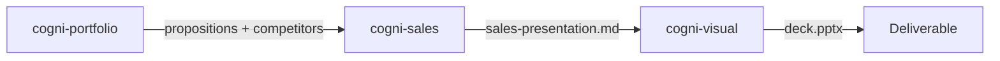

# Portfolio to Pitch

**Pipeline**: cogni-portfolio → cogni-sales → cogni-visual
**Duration**: 3–6 hours for a complete deal-specific pitch deck
**End deliverable**: A customer-tailored sales presentation in PPTX format, with a supporting proposal document



## What You Get

A structured pitch built on the Corporate Visions Why Change methodology — four phases (Why Change, Why Now, Why You, Why Pay) with web-researched evidence, sourced claims, and verified differentiation. cogni-visual renders the pitch narrative into a branded slide deck.

The pipeline produces two file types:
- `sales-presentation.md` — structured presentation content with assertion headlines and speaker notes
- `sales-proposal.md` — detailed proposal document for leave-behind use
- `deck.pptx` — rendered slide deck from the presentation brief

## Prerequisites

| Requirement | Why |
|-------------|-----|
| cogni-portfolio installed | Provides products, propositions, markets, competitors |
| cogni-sales installed | Orchestrates the Why Change pitch pipeline |
| cogni-visual installed | Renders the pitch to slides |
| cogni-narrative installed | Required by cogni-sales for story arc patterns |
| Web access enabled | cogni-sales dispatches web research per pitch phase |
| Portfolio project initialized | cogni-sales reads from an existing cogni-portfolio project |

If you don't yet have a portfolio project, complete `/portfolio-setup` before running this workflow. See the [cogni-portfolio plugin guide](../plugin-guide/cogni-portfolio.md).

## Step-by-Step

### Step 1: Prepare Portfolio Data

cogni-sales reads product data, propositions, market definitions, and competitor analysis from an existing cogni-portfolio project. If you already have one, start with Step 2. If not, set one up now.

**Minimum portfolio setup for a pitch:**

```
/portfolio-setup
```

Then define the elements cogni-sales needs:

```
/products
/features
/markets
/propositions
/compete
```

**Example prompt to generate propositions quickly:**

```
Generate propositions for all features in the enterprise cloud migration market
```

If you want to visualize the product-feature hierarchy before building the pitch (recommended for complex portfolios):

```
/portfolio-architecture
```

This produces a layered diagram showing products, features, readiness states, and cross-product bridges — useful for catching gaps before the pitch narrative is written.

### Step 2: Generate the Why Change Pitch

Run the `/why-change` skill. It walks through four research phases, each backed by dedicated web-research agents that gather evidence specific to your customer or market segment.

**Command**: `/why-change`

**Two modes:**

| Mode | When to use | What it does |
|------|------------|-------------|
| Customer mode | Named account deal | Company-specific research — news, financials, competitive position |
| Segment mode | Reusable vertical pitch | Industry-level research — market trends, regulatory pressure, segment benchmarks |

**Example prompts:**

```
Create a Why Change pitch for Siemens Manufacturing — cloud infrastructure portfolio
```

```
Build a segment pitch for mid-market SaaS companies in DACH migrating from on-premise ERP
```

```
/why-change
```

**What the pipeline produces per phase:**

- `01-why-change/` — unconsidered needs: industry disruptions, regulatory shifts, competitive pressure
- `02-why-now/` — urgency drivers: deadlines, competitive moves, market windows
- `03-why-you/` — differentiation: unique capabilities, competitive gaps, proof points
- `04-why-pay/` — business impact: ROI models, TCO comparisons, risk quantification

Review each phase narrative before the synthesizer assembles the final deliverables. The `pitch-synthesizer` agent produces `output/sales-presentation.md` and `output/sales-proposal.md`.

**Optional — verify claims before rendering:**

```
/claims verify
```

### Step 3: Render to Slides

Take the `sales-presentation.md` output from cogni-sales and render it as a PPTX deck via cogni-visual.

**Command**: Describe the task or invoke the story-to-slides skill

**Example prompts:**

```
Create a presentation from the sales presentation file and render it as slides
```

```
Turn the Siemens pitch into a slide deck — 12 slides maximum
```

**What cogni-visual produces:**

1. A presentation brief (YAML + Markdown) with audience modeling, slide layout mapping, assertion headlines, number plays, and speaker notes
2. A PPTX file rendered via `document-skills:pptx`, inheriting your cogni-workspace brand theme

**Optional — generate a web leave-behind as well:**

```
Create a scrollable web version of the pitch narrative
```

This runs `story-to-web` and renders via Pencil MCP — useful for sending a follow-up link after the meeting.

## Variations

| Variation | What to change | When to use |
|-----------|---------------|-------------|
| Segment pitch (reusable) | Select segment mode in Step 2 | Same pitch reused across multiple similar customers |
| Add TIPS enrichment | Request trend enrichment during pitch setup | "Why Now" phase needs strategic urgency from industry trends |
| Polish before rendering | Run `/copywrite sales-presentation.md` between Steps 2 and 3 | High-stakes executive meetings |
| Stakeholder review | Run `/review-doc sales-presentation.md` | C-suite or board-level audience |
| Claims verification | Run `/claims verify` after Step 2 | Externally shared content with sourced market claims |
| Web narrative instead of slides | Use `story-to-web` instead of `story-to-slides` in Step 3 | Digital follow-up or async review by the customer |

## Common Pitfalls

- **Generic propositions.** If the portfolio propositions are written at segment level, a customer-mode pitch will still sound generic. Tailor DOES/MEANS statements to the specific account before running the pitch.
- **Skipping "Why Change."** The unconsidered need is the core of the methodology. If you skip or thin this phase, the rest of the pitch becomes a feature list rather than a change story.
- **Too many slides.** Executive pitches work best at 10–15 slides. cogni-visual will generate more if you don't set a constraint — specify the slide count in your render prompt.
- **Running without a portfolio project.** cogni-sales requires products, propositions, and competitors from cogni-portfolio. Running `/why-change` without a portfolio project will prompt you to set one up first.

## Related Guides

- [cogni-portfolio plugin guide](../plugin-guide/cogni-portfolio.md)
- [cogni-sales plugin guide](../plugin-guide/cogni-sales.md)
- [cogni-visual plugin guide](../plugin-guide/cogni-visual.md)
- [Trends to Solutions workflow](./trends-to-solutions.md) — enrich the "Why Now" phase with trend data
- [Consulting Engagement workflow](./consulting-engagement.md) — portfolio-to-pitch runs inside the Deliver phase
