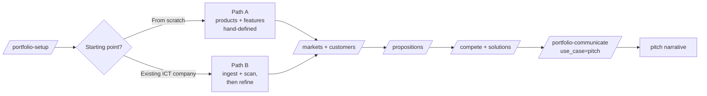

# Portfolio to Pitch

**Pipeline**: cogni-portfolio (end-to-end) — setup → foundation → commercial layer → messaging → pitch
**Duration**: 2–5 hours for a first pitch; longer if the foundation work is new
**End deliverable**: `output/communicate/pitch/{market-slug}.md` — an arc-structured presentation narrative produced by `/portfolio-communicate`, ready to render with `/story-to-slides` or `/story-to-web`



## What You Get

A complete portfolio built entirely inside cogni-portfolio, with a stakeholder-ready pitch as the final artifact. The workflow walks you from an empty project (or a company you've just onboarded) through the full FAB stack — products, features, markets, customers, propositions — and lands on a pitch narrative generated by `/portfolio-communicate`.

Along the way you produce:

- **Foundation** — products, features, (optionally) a lean-canvas import, (optionally) a discovered inventory from `/portfolio-ingest` and `/portfolio-scan`
- **Commercial layer** — markets with TAM/SAM/SOM, ICPs and buyer personas per market
- **Messaging** — IS/DOES/MEANS propositions per Feature × Market, sharpened with competitor battle cards and (optionally) solution blueprints with pricing tiers
- **Pitch** — `output/communicate/pitch/{market-slug}.md` (arc-structured, `arc_id` in frontmatter). Optionally render visually with `/story-to-slides`, `/story-to-web`, or `/story-to-storyboard`
- **Optional visuals** — `/portfolio-dashboard` (interactive HTML) and `/portfolio-architecture` (Excalidraw product-feature map)

## Prerequisites

| Requirement | Why |
|-------------|-----|
| cogni-portfolio installed | All steps in the core flow live here |
| A target market or buyer in mind | The pitch is generated per market; you need at least one |
| Path B only: source material available | URLs for `/portfolio-scan` and/or documents in `uploads/` for `/portfolio-ingest` |
| Optional: theme picked via `/pick-theme` | Visuals and (downstream) rendered slides inherit your workspace brand |

## Choose Your Starting Path

Pick before Step 2 — the rest of the flow reconverges:

- **Path A — From scratch.** A founder, consultant, or product team starting from an idea or hypothesis. No existing offerings to discover. You define products and features directly, optionally seeded from a Lean Canvas or Business Model Canvas.
- **Path B — From an existing ICT company.** The company already has services, a website, brochures, proposals. The first job is to discover what exists and classify it, then refine.

If both apply (e.g., an existing firm launching a new line), start with Path B for the established offering, then re-enter Path A for the new line inside the same project.

## Start or resume with `/portfolio-resume`

`/portfolio-resume` is the standard entry gate for cogni-portfolio — run it first at the top of every session, whether you are starting a new portfolio or coming back to one you already have:

- **New session, no project yet** — `/portfolio-resume` detects that nothing exists and points you straight at `/portfolio-setup` (Step 1 below).
- **Returning to existing work** — it reports current progress against the stages in this workflow, flags stale entities, and recommends the next skill to run, so you pick up exactly where you left off instead of guessing.

The rest of this workflow still applies as written. Think of `/portfolio-resume` as the dashboard you check first; the numbered steps below are what it dispatches you into.

## Step-by-Step

### Step 1 — Initialize the project (shared)

Create the project scaffold and capture company context. `/portfolio-setup` also picks a taxonomy template, which Path B relies on for classification.

```
/portfolio-setup
```

This writes `portfolio.json` and creates the `products/`, `features/`, `markets/`, `customers/`, `propositions/`, `solutions/`, `competitors/`, `taxonomy/`, and `output/` directories.

### Step 2 — Populate the foundation (Path A or Path B)

#### Path A — From scratch

**2A.1 (optional)** If you have a Lean Canvas or Business Model Canvas, seed products, features, and markets from it:

```
/portfolio-canvas
```

**2A.2** Define top-level offerings:

```
/products
```

**2A.3** Define market-independent capabilities (the IS layer of FAB). This is hard-gated on at least one product existing:

```
/features
```

**Example prompt:**

```
I'm starting a boutique data-engineering practice. Help me define two products — managed data platform and advisory — with three features each
```

#### Path B — From an existing ICT company

**2B.1 (optional)** If the bundled taxonomy templates don't fit the company's industry, customize or import one first:

```
/portfolio-taxonomy
```

**2B.2** Extract entities from documents in `uploads/` (PDF, DOCX, PPTX, XLSX, MD):

```
/portfolio-ingest
```

**2B.3** Discover services from the company's website(s) and classify them against the taxonomy:

```
/portfolio-scan
```

**Example prompts:**

```
Scan acme-ict.com and classify the service portfolio against the bundled IT services taxonomy
```

```
Ingest the uploaded service brochures and pull out distinct products and features
```

**2B.4** Refine what discovery produced. Promote the keepers, archive the noise, fix names and boundaries:

```
/products
/features
```

**2B.5 (optional)** When you're scanning peer companies for comparative coverage across the same taxonomy:

```
/portfolio-consolidate
```

### Step 3 — Define the commercial layer (shared)

Target markets first — including sizing — then buyer profiles per market.

```
/markets
/customers
```

`/markets` produces TAM/SAM/SOM per segment. `/customers` generates ICPs and buyer personas for each active market. Both steps feed the pitch directly: the pitch is market-scoped, and the narrative lifts language from the buyer personas.

### Step 4 — Generate the messaging (shared)

This is the hinge step. `/portfolio-communicate` turns propositions into a pitch — everything upstream feeds in through them.

```
/propositions
```

Produces IS/DOES/MEANS propositions per Feature × Market pair, with a quality assessment per proposition. Review and tighten before moving on.

### Step 5 — Sharpen with competitive and commercial context (shared)

Both are optional but strongly recommended before generating anything customer-facing.

```
/compete
/solutions
```

`/compete` builds battle cards per proposition — who competes, where you win, where you lose. `/solutions` defines implementation plans and pricing tiers that give the pitch credible "what it costs, what you get" answers.

**Path B gate — verify before you communicate.** Anything sourced from the web (scans, external research inside propositions, competitor claims) should be verified before it lands in a pitch:

```
/portfolio-verify
```

This cross-checks web-sourced claims against their cited sources and flags deviations.

### Step 6 — Produce the pitch (shared)

Generate the arc-structured pitch narrative:

```
/portfolio-communicate
```

Pick the `pitch` use case and the target market. The skill writes `output/communicate/pitch/{market-slug}.md` with `arc_id` in frontmatter (default arc: `jtbd-portfolio`), which makes it directly consumable downstream without an intermediate `/narrative` step.

**Example prompts:**

```
Generate a portfolio pitch for the mid-market SaaS segment
```

```
/portfolio-communicate — pitch for the DACH manufacturing market, use the corporate-visions arc
```

**Optional — render visually:**

```
Render the mid-market SaaS pitch as a slide deck
```

```
Create a scrollable web version of the DACH manufacturing pitch
```

These dispatch to `/story-to-slides` or `/story-to-web` inside cogni-visual, inheriting your workspace theme.

### Optional — stakeholder visuals (shared)

Useful for walking clients through what you've built before you pitch them:

```
/portfolio-dashboard
/portfolio-architecture
```

`/portfolio-dashboard` produces an interactive HTML view of the whole portfolio. `/portfolio-architecture` produces an Excalidraw diagram of products, features, and their cross-links.

## Variations

| Variation | What to change | When to use |
|-----------|---------------|-------------|
| Founder with a lean canvas | Start Path A at 2A.1 with `/portfolio-canvas` | Seed stage — you have a canvas, not yet a portfolio |
| Consultant onboarding a new client | Start Path B with `/portfolio-ingest` + `/portfolio-scan` | Client has established offerings, brochures, a live site |
| Service firm modernizing offerings | Path B through Step 2, then re-enter Path A for new lines | Established portfolio plus new bets in the same project |
| Boutique positioning against larger competitors | Emphasize `/compete` in Step 5 | Differentiation is the core of the pitch |
| Re-pitching into a second market | Add the new market at Step 3, re-run `/propositions` and `/portfolio-communicate` for that market only | Existing portfolio, new segment, same features |
| Multi-session work | Use `/portfolio-resume` to re-enter | Long engagements spread across sessions |

## Common Pitfalls

- **Generic propositions.** If IS/DOES/MEANS statements read the same across markets, the pitch will too. Tailor DOES and MEANS to each Feature × Market before Step 6.
- **Skipping markets and customers.** A pitch written without a defined market and persona slides into feature-listing. The arc needs a buyer's jobs and friction to push against.
- **Over-rendering before the content is solid.** Generating slides or web output before the pitch markdown is tight just hides weak content behind styling. Iterate on Step 6's markdown first.
- **Path B — trusting discovery verbatim.** `/portfolio-scan` and `/portfolio-ingest` produce drafts, not truth. Refine in 2B.4, then verify with `/portfolio-verify` before anything goes customer-facing.
- **Path A — jumping to `/propositions` early.** Propositions are Feature × Market. If features are still in flux, propositions will churn every time you rename one. Stabilize the foundation first.

## Related Guides & Follow-ups

**Related workflows:**

- [Install to Infographic workflow](./install-to-infographic.md) — from a fresh install through your first visual deliverable
- [Trends to Solutions workflow](./trends-to-solutions.md) — the upstream pipeline that this workflow can optionally consume via the bridge below

**Plugin guides:**

- [cogni-portfolio plugin guide](../plugin-guide/cogni-portfolio.md)

**Follow-ups beyond this workflow:**

- **Inject trend signals — cogni-trends `trends-bridge`.** If you want features driven by TIPS trend analysis, or you want to pull solution templates from a trend-scout pursuit into this portfolio, run the `trends-bridge` skill after Step 2. It's bidirectional — you can also export a completed portfolio context back into a cogni-trends value-modeler run. See the [cogni-trends plugin guide](../plugin-guide/cogni-trends.md).
- **Deal-ready sales artifacts — cogni-sales `why-change`.** The pitch produced in Step 6 is a reusable presentation foundation; it does not do per-customer web research, Why Pay cost-of-inaction quantification, or a formal sales proposal with assess/revise review. When you need to take a specific deal to a specific buyer, run `/why-change` — it takes this portfolio as input and adds those layers. See the [cogni-sales plugin guide](../plugin-guide/cogni-sales.md).
