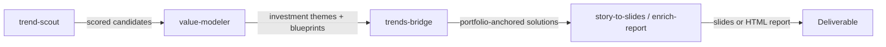

# Trends to Solutions

**Pipeline**: cogni-trends (trend-scout + value-modeler) → cogni-portfolio (trends-bridge) → cogni-visual (story-to-slides / enrich-report)
**Duration**: 4–8 hours for a complete trends-to-solutions analysis
**End deliverable**: Ranked solution blueprints with visual deliverables (slide deck or enriched HTML report)



## What You Get

A structured path from raw trend signals to portfolio-anchored solutions, with a visual architecture diagram at the end.

- **Scored trend candidates** mapped to the Smarter Service Trendradar (4 dimensions, 3 action horizons)
- **Investment themes** (Handlungsfelder) with T→I→P→S value paths — each trend analyzed through Trend, Implications, Possibilities, Solutions
- **Solution blueprints** with portfolio composition, readiness scoring, and optionally anchored to your actual products and features
- **Visual deliverables** — slide deck or enriched HTML report presenting the solution landscape

This workflow is suited to strategy and advisory work where clients need to understand which trends matter and what to do about them.

## Prerequisites

| Requirement | Why |
|-------------|-----|
| cogni-trends installed | Runs trend scouting and value modeling |
| cogni-portfolio installed | Provides product anchoring via trends-bridge |
| cogni-visual installed | Renders visual deliverables (slides, enriched reports) |
| Web access enabled | cogni-trends dispatches 32+ bilingual web searches |
| cogni-portfolio project (optional) | Enables product-anchored solution blueprints |

cogni-portfolio is not strictly required — cogni-trends can produce solution blueprints without it. With cogni-portfolio, blueprints reference your actual products and features rather than generic solution templates.

## Step-by-Step

### Step 1: Scout Trends

Run `trend-scout` to initialize a research project for your target industry. One `trend-web-researcher` agent runs 32 bilingual web searches (EN + DE) plus academic, patent, and regulatory queries. A `trend-generator` agent then produces 60 scored candidates using multi-framework analysis.

**Command**: Describe the industry or use the skill directly

**Example prompts:**

```
Scout trends for the automotive manufacturing industry
```

```
trend-scout — I want to analyze strategic trends in B2B SaaS
```

```
Scout trends for industrial IoT in the DACH market
```

**Scoring dimensions:**

Each candidate is scored on impact, probability, strategic fit, source quality (CRAAP), and signal strength. Trendradar placement is automatic — candidates are assigned to one of four dimensions (Externe Effekte, Neue Horizonte, Digitale Wertetreiber, Digitales Fundament) and one of three action horizons (Act 0–2y, Plan 2–5y, Observe 5+y).

**Refine the candidate set before proceeding.** The scout produces 60 candidates — narrow to 15–25 that are most relevant to your engagement before running the value modeler:

```
Show me the top candidates in the Act horizon — I want to focus on near-term opportunities
```

### Step 2: Model Investment Themes and Solution Blueprints

Run `value-modeler` to consolidate scouted candidates into 3–7 MECE investment themes (Handlungsfelder) and expand each through the T→I→P→S value chain. The modeler generates solution templates with portfolio blueprints and readiness scoring.

**Command**: Describe the task or invoke directly

**Example prompts:**

```
Model investment themes from the scouted automotive trends
```

```
Generate solution blueprints — anchor to my cogni-portfolio project
```

```
Build investment themes and show me the Business Relevance scoring
```

**With portfolio anchoring** (recommended when you have a cogni-portfolio project):

The `trends-bridge` skill in cogni-portfolio provides bidirectional integration. From cogni-trends, request portfolio anchoring during value modeling:

```
Model themes and anchor solution blueprints to the cogni-portfolio project at ./cogni-portfolio/cloud-services/
```

This maps solution components to real products and features in your portfolio, producing grounded blueprints instead of generic recommendations.

**Review the Business Relevance scoring.** The value modeler surfaces a scoring interface for each investment theme — adjust weights for your client context before generating solution blueprints.

**Output**: Investment themes with T→I→P→S paths and solution blueprints in `value-model/` directory.

### Step 3: Produce Visual Deliverables

Use cogni-visual to present the solution landscape visually:

**Option A — Slide deck**: Run `story-to-slides` on a narrative derived from the value-modeler output to create an executive presentation.

**Option B — Enriched report**: Run `/enrich-report` on the trend report to produce a themed HTML report with Chart.js visualizations.

**Example prompts:**

```
Create a slide deck from the automotive investment themes narrative
```

```
/enrich-report path/to/tips-trend-report.md
```

## Variations

| Variation | What to change | When to use |
|-----------|---------------|-------------|
| Generate trend report instead of diagram | Run `trend-report` after Step 2 | Stakeholders need a written CxO narrative, not a diagram |
| Skip portfolio anchoring | Run value modeler without portfolio reference | No cogni-portfolio project available; blueprints use generic templates |
| Focus on one Trendradar dimension | Filter candidates by dimension after Step 1 | Client engagement scoped to one layer (e.g., Foundation only) |
| Export to industry catalog | Run `trends-catalog` after Step 2 | Cross-engagement reuse — solutions, SPIs, and metrics saved for future pursuits |
| Add claims verification | Run `/claims verify` after Step 2 | Trend report citations need external verification before client delivery |
| Multi-session workflow | Use `trends-resume` to re-enter | Large industry scans spread across multiple sessions |

## Common Pitfalls

- **Too many themes.** The value modeler can produce up to 7 investment themes. For a client presentation, 3–4 themes are more digestible. Narrow before generating visual deliverables.
- **Weak trend selection in Step 1.** Generic trends produce generic solutions. Invest time in Step 1 reviewing and culling the 60 candidates — the quality of the final deliverable depends on the quality of what feeds into value modeling.
- **Skipping Business Relevance scoring.** The scoring interface lets you weight themes by what matters to the client. Default weights may not reflect the client's strategic priorities — adjust before generating blueprints.

## Related Guides

- [cogni-trends plugin guide](../plugin-guide/cogni-trends.md)
- [cogni-portfolio plugin guide](../plugin-guide/cogni-portfolio.md)
- [cogni-visual plugin guide](../plugin-guide/cogni-visual.md)
- [Consulting Engagement workflow](./consulting-engagement.md) — this pipeline runs inside the Discover and Develop phases
- [Content Pipeline workflow](./content-pipeline.md) — trends output feeds marketing content generation
