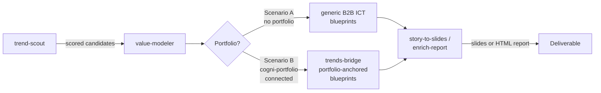

# Trends to Solutions

**Pipeline**: cogni-trends (trend-scout + value-modeler) → optional cogni-portfolio (trends-bridge) → cogni-visual (story-to-slides / enrich-report)
**Duration**: 4–8 hours for a complete trends-to-solutions analysis
**End deliverable**: Ranked solution blueprints with visual deliverables (slide deck or enriched HTML report)



## What You Get

A structured path from raw trend signals to ranked solutions, with a visual deliverable at the end. Two scenarios share Step 1 and Step 4, and branch at Step 2 based on whether a cogni-portfolio project is connected.

- **Scored trend candidates** mapped to the Smarter Service Trendradar (4 dimensions, 3 action horizons)
- **Investment themes** (Handlungsfelder) with T→I→P→S value paths — each trend analyzed through Trend, Implications, Possibilities, Solutions
- **Solution blueprints** — taxonomy-grounded generic templates (Scenario A) or anchored to your real products and features (Scenario B)
- **Optional portfolio backflow** (Scenario B) — ranked solutions become new features, proposition variants, and innovation opportunities inside cogni-portfolio
- **Visual deliverables** — slide deck or enriched HTML report presenting the solution landscape

This workflow is suited to strategy and advisory work where clients need to understand which trends matter and what to do about them.

## Prerequisites

| Requirement | Why |
|-------------|-----|
| cogni-trends installed | Runs trend scouting and value modeling |
| cogni-visual installed | Renders visual deliverables (slides, enriched reports) |
| Web access enabled | cogni-trends dispatches 32+ bilingual web searches |
| cogni-portfolio installed (optional) | Required for Scenario B; enables product-anchored solution blueprints and the trends-bridge backflow |
| cogni-portfolio project (optional) | Required for Scenario B; carries the products, features, and propositions that anchor blueprints |

The "Choose Your Scenario" section below explains which prerequisites apply to which path.

## Choose Your Scenario

Pick before Step 2 — the rest of the flow reconverges on Step 4 (visual deliverables):

- **Scenario A — Standalone trends + generic blueprints.** No cogni-portfolio project. value-modeler uses the bundled **generic B2B ICT portfolio** (7 products, 51 features with taxonomy mappings) as the anchor and generates DOES/MEANS dynamically from your research context. Outputs are taxonomy-grounded but not company-specific. Use when scouting a new industry, doing a discovery engagement, or producing a CxO-level point of view without a defined product set.
- **Scenario B — With cogni-portfolio connected.** A cogni-portfolio project exists (or you build one before Step 2). `trends-bridge` exports portfolio context to value-modeler so Solution Templates map to real products and features, and ranked solutions can flow back into the portfolio as new features, proposition variants, evidence entries, and innovation opportunities. Use when you want trend signals to drive your actual portfolio roadmap.

If you start in Scenario A and later build a portfolio, you can re-enter Scenario B against the same trend-scout output without re-scouting.

## Step-by-Step

### Step 1: Scout Trends (shared)

Run `trend-scout` to initialize a research project for your target industry. One `trend-web-researcher` agent runs 32 bilingual web searches (EN + DE) plus academic, patent, and regulatory queries. A `trend-generator` agent then produces 60 scored candidates using multi-framework analysis.

This step is identical in both scenarios.

**Command**: Describe the industry or use the skill directly

**Example prompts:**

```
Scout trends for the automotive manufacturing industry
```

```
trend-scout — I want to analyze strategic trends in B2B SaaS
```

```
Scout trends for industrial IoT in the DACH market
```

**Scoring dimensions:**

Each candidate is scored on impact, probability, strategic fit, source quality (CRAAP), and signal strength. Trendradar placement is automatic — candidates are assigned to one of four dimensions (Externe Effekte, Neue Horizonte, Digitale Wertetreiber, Digitales Fundament) and one of three action horizons (Act 0–2y, Plan 2–5y, Observe 5+y).

**Refine the candidate set before proceeding.** The scout produces 60 candidates — narrow to 15–25 that are most relevant to your engagement before running the value modeler:

```
Show me the top candidates in the Act horizon — I want to focus on near-term opportunities
```

### Step 2: Model Investment Themes and Solution Blueprints

`value-modeler` consolidates scouted candidates into 3–7 MECE investment themes (Handlungsfelder) and expands each through the T→I→P→S value chain. It generates Solution Templates with portfolio blueprints, SPIs, success metrics, and Business Relevance scoring.

**Review the Business Relevance scoring** in either scenario. The value modeler surfaces a scoring interface for each investment theme — adjust weights for your client context before generating solution blueprints. Default weights may not reflect the client's strategic priorities.

The mechanics differ depending on whether a portfolio is connected. Pick the subsection below that matches your scenario.

#### Scenario A — Standalone (generic B2B ICT portfolio)

Run `value-modeler` directly. With no cogni-portfolio project in the workspace, Phase 2 falls back to a **generic B2B ICT portfolio** — 7 products, 51 features with IS-layer descriptions and taxonomy mappings derived from the B2B ICT taxonomy. DOES/MEANS propositions are generated dynamically from your project's research context (industry, subsector, research topic).

**Example prompts:**

```
Model investment themes from the scouted automotive trends
```

```
Build investment themes and show me the Business Relevance scoring
```

The output is a **taxonomy-grounded** view — each Solution Template maps to ICT capability dimensions with coverage data, instead of abstract solutions. It is useful for advisory POVs and CxO conversations, but it is not a substitute for grounding solutions in your actual capabilities.

**Output**: Investment themes with T→I→P→S paths and generic solution blueprints in `value-model/`.

#### Scenario B — With cogni-portfolio connected

Two sub-steps: export portfolio context, then run value-modeler against it.

**2B.1 — Export portfolio context.** Run `trends-bridge` with the `portfolio-to-tips` operation. This writes `portfolio-context.json` (v3.2 schema) into your trend-scout pursuit so `value-modeler` Phase 2 can consume it. This is a hard prerequisite for portfolio-anchored blueprints.

```
/trends-bridge portfolio-to-tips
```

```
Export the cloud-services portfolio context into the current TIPS pursuit
```

If you skip this sub-step, value-modeler silently falls back to the generic B2B ICT portfolio and your solutions will not reference your real features.

**2B.2 — Run `value-modeler` with portfolio anchoring.** Solution Templates now map to real features; readiness scoring reflects actual portfolio gaps; Business Relevance scoring weighs real propositions and pricing.

```
Model themes and anchor solution blueprints to the cogni-portfolio project at ./cogni-portfolio/cloud-services/
```

```
Generate solution blueprints — anchor to my cogni-portfolio project
```

**Output**: Investment themes with T→I→P→S paths and **portfolio-anchored** solution blueprints in `value-model/`, each linked to specific products, features, and propositions in the connected portfolio.

### Step 3: Backflow ranked solutions into the portfolio (Scenario B only)

Run `trends-bridge` with the `tips-to-portfolio` operation to push ranked Solution Templates back into the portfolio. This creates new features, proposition variants, evidence entries, and an `portfolio-opportunities.json` file capturing innovation opportunities the trend signals surfaced.

```
/trends-bridge tips-to-portfolio
```

```
Backflow the ranked solutions into the cloud-services portfolio
```

This closes the loop: trend signals become portfolio mutations the team can build against. Review and curate the generated entities inside cogni-portfolio (`/features`, `/propositions`, `/solutions`) before they propagate downstream into pitches and marketing.

**Skip this step in Scenario A** — there is no portfolio to push into.

### Step 4: Produce Visual Deliverables (shared)

Use cogni-visual to present the solution landscape visually. Both options work for either scenario; the underlying value-model JSON is the same shape.

**Option A — Slide deck**: Run `story-to-slides` on a narrative derived from the value-modeler output to create an executive presentation.

**Option B — Enriched report**: Run `/enrich-report` on the trend report to produce a themed HTML report with Chart.js visualizations.

**Example prompts:**

```
Create a slide deck from the automotive investment themes narrative
```

```
/enrich-report path/to/tips-trend-report.md
```

## Variations

| Variation | What to change | When to use |
|-----------|---------------|-------------|
| Generate trend report instead of diagram | Run `trend-report` after Step 2 | Stakeholders need a written CxO narrative, not a diagram |
| Start standalone, add portfolio later | Run Scenario A first; once a cogni-portfolio project exists, re-run Step 2 as Scenario B against the same trend-scout output | Engagement starts as discovery, hardens into portfolio work |
| Focus on one Trendradar dimension | Filter candidates by dimension after Step 1 | Client engagement scoped to one layer (e.g., Foundation only) |
| Export to industry catalog | Run `trends-catalog` after Step 2 | Cross-engagement reuse — solutions, SPIs, and metrics saved for future pursuits |
| Add claims verification | Run `/claims verify` after Step 2 | Trend report citations need external verification before client delivery |
| Multi-session workflow | Use `trends-resume` to re-enter | Large industry scans spread across multiple sessions |

## Common Pitfalls

- **Too many themes.** The value modeler can produce up to 7 investment themes. For a client presentation, 3–4 themes are more digestible. Narrow before generating visual deliverables.
- **Weak trend selection in Step 1.** Generic trends produce generic solutions. Invest time in Step 1 reviewing and culling the 60 candidates — the quality of the final deliverable depends on the quality of what feeds into value modeling.
- **Skipping Business Relevance scoring.** The scoring interface lets you weight themes by what matters to the client. Default weights may not reflect the client's strategic priorities — adjust before generating blueprints.
- **Scenario A — confusing generic blueprints for company-specific advice.** The bundled B2B ICT portfolio is a taxonomy scaffold, not a real product set. Useful for "what to do about this trend" advisory framing; not a substitute for grounding solutions in your actual capabilities.
- **Scenario B — forgetting Step 2B.1.** value-modeler in Scenario B requires `portfolio-context.json`. If you skip the `portfolio-to-tips` export, value-modeler silently falls back to the generic portfolio and your solutions will not reference your real features.

## Related Guides

- [cogni-trends plugin guide](../plugin-guide/cogni-trends.md)
- [cogni-portfolio plugin guide](../plugin-guide/cogni-portfolio.md) — see the `trends-bridge` section for authoritative reference on the bridge operations
- [cogni-visual plugin guide](../plugin-guide/cogni-visual.md)
- [Consulting Engagement workflow](./consulting-engagement.md) — this pipeline runs inside the Discover and Develop phases
- [Content Pipeline workflow](./content-pipeline.md) — trends output feeds marketing content generation
- [Portfolio to Pitch workflow](./portfolio-to-pitch.md) — the portfolio side; pairs naturally with Scenario B
